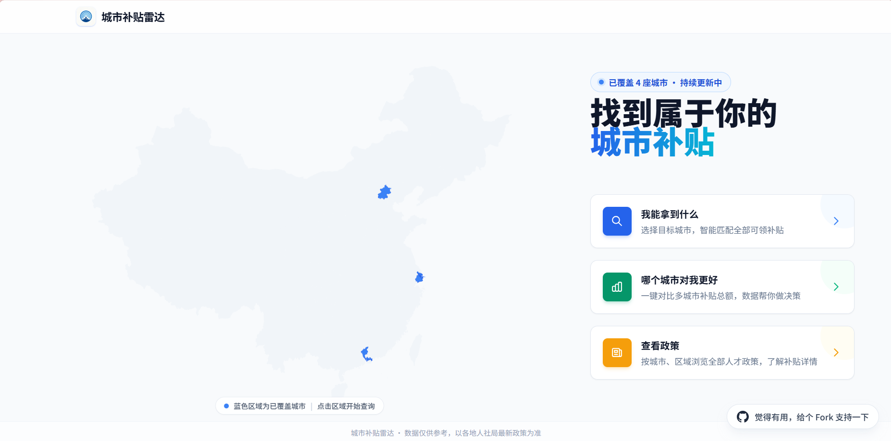

【标签】`社会服务`

【标题】【社会服务赛道】城市补贴雷达 —— 应届毕业生人才补贴智能匹配工具

---

## 0. 先和大家打个招呼吧

**我是谁**：一名0技术背景的即将去深圳入职的应届生

**我是怎么用 TRAE 把这个 Demo 做出来的**：

说实话，参赛前我没想过自己能在几天内把一个完整的查询工具从 0 推到线上。整个 Demo 从项目初始化、政策获取、页面搭建、规则引擎到部署，都是在 **TRAE WORK** 里跟 AI 一句句"聊"出来的。

我会让 TRAE 一次性爬取大量政策文件，帮我筛选关键信息、理解政策逻辑并设计条件匹配规则，它通常能给出八九十分的代码。作为零代码基础的用户，我大部分时间其实是在做测试审查工作——运行代码、确认效果是否符合预期。我把 TRAE 当作协作伙伴，不断把一闪而过的模糊想法丢给它，我们一起讨论细节、确认方案、制定技术路线，快速把想法变成可运行的功能。

这个作品本身也是为我遇到过的痛点做的，所以写起来特别有动力。希望它也能帮到你。

---

## 1. Demo 简介

**是什么**：城市补贴雷达是一个可以根据自身条件匹配人才补贴的**网站工具**，打开浏览器即可使用。
**面向谁**：即将或刚刚跨城市就业的应届毕业生（专科/本科/硕士/博士），以及毕业 2 年内想查漏补缺的往届生。

**主要功能**：

1. **智能匹配补贴**：输入毕业院校、学历、专业、年龄、目标城市和区域，一键匹配你能申领的人才补贴，自动处理互斥组取最高值、多通道认定、区域筛选。

2. **城市补贴对比**：不选具体城市，直接对比多个城市预计可领补贴总额，辅助 offer 决策。

3. **反向匹配 + 待办清单**：列出你"差一点就能领"的补贴，自动过滤学历/专业等不可变条件，只推荐落户、社保等你还能补齐的项，并生成材料、渠道、截止时间的待办清单。


---

## 2. Demo 创作思路

### 灵感来源

我自己就是即将去深圳入职的应届生。拿到 offer 后开始研究深圳的人才补贴，听说应届生能领租房补贴，结果查完发现：我虽然是211本科，但我的专业不在深圳《重点产业专业目录》里，根本不符合条件。

后来又陆续听说各区落户补贴、人才认定……信息分散在人社局官网、App、公众号等多个渠道，逐条核对条件非常痛苦，还容易漏掉。我就想：如果有一个工具，能根据我的个人条件直接算出"你能拿多少、还差什么、该按什么顺序办"，该省多少事。于是从一个政策开始入手，逐步扩展到四个一线城市的45条政策，顺手做出了这个希望能帮到更多人的工具。

### 想解决的问题

- **信息碎片化**：补贴政策分散在多个渠道，查全、查准成本高。
- **条件看不懂**：条件过于冗杂，认定标准不清晰。
- **顺序搞不清**：落户、社保、居住证、补贴申请环环相扣，顺序错了可能耽误几个月。
- **没人告诉你"还差什么"**：现有工具通常只输出"符合/不符合"，不会给出可操作的提升路径。

### 为什么做这个方向

每年有上千万高校毕业生跨城市就业，人才补贴是城市吸引年轻人的重要手段，但信息不对称导致大量补贴无人问津。这个方向既有真实的个人痛点，也有明确的社会价值——用技术降低政策信息获取门槛，本身就是一种信息公平。

---

## 3. Demo 体验地址

**在线体验**：https://subsidyradar-829.pages.dev/

> 如果无法访问在线版本，也可以直接克隆仓库在本地运行体验：
>
> ```bash
> git clone https://github.com/chi-ga/city-subsidy-radar.git
> cd city-subsidy-radar/frontend
> npm install
> npm run dev
> ```

**项目仓库**：https://github.com/chi-ga/city-subsidy-radar

**当前覆盖城市**：北京、上海、深圳、广州

**当前数据规模**：

| 数据类型 | 数量 | 说明 |
|---------|------|------|
| 补贴政策 | 45 条 | 北上广深四城人才/租房/生活/落户等补贴 |
| 院校数据 | 1,176 所 | 813 所国内高校 + 363 所境外高校，支持中文/拼音/简称/别名搜索 |
| 本科专业 | 805 个 | 含 2024 年教育部新增的 9 种专业 |
| 双一流学科 | 147 校 × 501 条 | 第二轮双一流建设高校及学科 |

---

## 4. TRAE 实践过程

整个 Demo 使用 **TRAE IDE** 完成开发，核心代码和关键决策都通过 TRAE 的 AI 辅助完成。项目是纯前端 SPA，补贴规则、院校/专业数据全部以静态 JSON 内嵌，匹配逻辑在前端执行。

开发过程中，我同时使用了 **TRAE WORK** 和 **TRAE IDE**：前期用 TRAE WORK 搜集整理政策文件；搭框架和写匹配逻辑时改用 TRAE IDE，能直接看到代码更有安全感；后期做审查和调整工作时又转回 TRAE WORK，因为它有移动端，出门在外灵感来了也能随时布置任务。

### 4.1 开发流程概览

1. **项目初始化**：用 TRAE 创建 React 19 + TypeScript + Vite 项目，配置 Tailwind CSS、React Router DOM 7、Zustand、ECharts 和 Vitest。
2. **页面骨架搭建**：实现首页（ECharts 中国地图 + 三路径入口）、条件输入页、结果分析页、城市对比页、政策库页五个核心页面；结果页和对比页等路由懒加载。
3. **数据整理与录入**：将北上广深 45 条补贴政策整理为统一 Schema 的 JSON，补充 1,176 所院校、805 个本科专业、深圳重点产业专业目录等数据。
4. **规则匹配引擎**：在 `src/utils/matcher.ts` 中实现核心匹配逻辑，包括：
   - `calculateTotalAmount`：按一次性/月/季/年计算实际可领金额；
   - `matchCriterionSet` + `matchByCriterionSets`：处理深圳青年人才认定等多通道"任一满足即匹配"的政策；
   - `matchAllSubsidies`：汇总匹配结果，处理互斥组取最高值，生成反向匹配和待办清单。
5. **院校/专业自动补全**：用 `useAsyncSearch` 泛化 Hook + 动态 `import()` 懒加载大体积 JSON，实现院校（中文/拼音/简称/别名，1,176 所）和专业（专业名/代码/一级学科，805 个）的异步搜索。
6. **城市专属字段**：通过 `city-conditions.json` 配置各城市/区域的有效条件，动态控制深圳 STEM/重点产业、北京三城一区、上海临港/留学回国、广州黄埔/花都在表单中的显示。
7. **AI 解读功能**：用 `useAIInterpret.ts` + `promptBuilder.ts` 实现大模型 API 调用，支持 OpenAI/DeepSeek/自定义接口，鲁棒 JSON 提取（直接解析 → Markdown 清洗 → 栈算法），30 秒超时降级。Demo 阶段隐藏设置入口。
8. **UI 打磨与响应式适配**：使用 Tailwind CSS 完成桌面端与移动端适配；桌面端首页展示 ECharts 中国地图，移动端地图隐藏，改用纯内容入口。
9. **测试与验收**：编写 Vitest 单元测试覆盖 `matcher.ts` 的金额计算、互斥组、多通道认定等核心逻辑。

### 4.2 开发过程中的关键迭代

在开发过程中，我和 TRAE 一起经历了多次迭代优化：

- **数据准确性优化**：发现双一流本科生误匹配南山5万补贴问题，拆分各城市按学历分拆的政策条目，修正广州花都博士补贴金额等数据错误；对照政策文档全面检查四城条件判断链，修正深圳补贴数据11项问题。

- **架构优化与代码质量**：完成7项架构优化（用户Store数据流修复、表单原子组件提取、搜索Hook泛化、路由懒加载、死代码清理、ESLint+Prettier配置、Vitest单元测试），修复12个TypeScript错误。

- **UI/UX 迭代**：统一政策卡片设计（分类色条、条件状态徽章、申请信息网格），修复动态字段过渡动画，优化首页布局与间距。

- **数据扩充**：高校名单从165所扩展到813所（含985/211/双一流/省重点/普通本科），海外高校363所，总计1,176所支持多名称搜索；专业目录更新至805个（含2024年教育部新增9个专业）。

- **功能增强**：新增港澳台居民身份筛选，对齐深圳前海补贴发放标准；实现问卷"选城市后分步展开"交互；完善落地待办清单申请流程展示；更正各条目effectiveDate为真实政策施行日期。

- **上线前审查**：使用 `add-city-subsidy` skill 完成项目上线前全流程审查。

### 4.3 开发关键步骤截图


讨论项目方向与需求，产出 PRD 和项目计划书 

搭建前端框架，实现 ECharts 中国地图可视化 

调整地图组件视觉效果，省级边界加粗高亮 

爬取高校数据并补充政策文档 

统一政策卡片设计，完善落地待办清单展示 

代码架构评审与匹配逻辑修正 

设计并使用skill 完成上线前审查 

### 4.4 关键任务 Session ID

| 任务 | Session ID |
|------|------------|
| 产出 PRD 和项目计划书 | 4030126157992412:4c0b0beaa53e6023a2b0f074bb077835_6a3762e59eea24673ba66ed6.6a3762e59eea24673ba66ed9.6a3762e59eea24673ba66ed7:TRAE Work CN.0.1.25.no_sid.no_ppe.T(2026/6/21 12:04:53)|
| 前端框架搭建与地图可视化实现 | 4030126157992412:582e1152375554015a0f5b306a481642_6a37674d9eea24673ba66f02.6a37674d9eea24673ba66f05.6a37674d9eea24673ba66f03:TRAE Work CN.0.1.25.no_sid.no_ppe.T(2026/6/21 12:23:41)|
| 调整地图组件视觉效果 | .4030126157992412:9affce2fa046e7e332b6ed8575c0aee2_6a3780280fbbfc8cb6a5fa0f.6a3780a10fbbfc8cb6a5fa11.6a3780a1271a2cc35c217923:Trae CN.T(2026/6/21 14:11:45) |
| 爬取高校数据并补充政策文档 | .4030126157992412:434f07e88399794ae60ec6b1372faf73_6a3796d70fbbfc8cb6a5fbc9.6a37979f0fbbfc8cb6a5fbcb.6a37979e271a2cc35c21792d:Trae CN.T(2026/6/21 15:49:51) |
| 修正深圳补贴数据11项问题与匹配逻辑 | .4030126157992412:1d975422763a8b5242558062829b9236_6a37be9c0fbbfc8cb6a60242.6a3936930fbbfc8cb6a60244.6a393692271a2cc35c21793d:Trae CN.T(2026/6/22 21:20:19) |
| 修正四城政策 JSON 金额数据 | 4030126157992412:e1205958ed1183db76892c67967e0790_6a3aab510fbbfc8cb6a61036.6a3aabed0fbbfc8cb6a61038.6a3aabec271a2cc35c21795a:Trae CN.T(2026/6/23 23:53:17) |
| 统一政策卡片设计 | 4030126157992412:e1205958ed1183db76892c67967e0790_6a3aab510fbbfc8cb6a61036.6a3aabed0fbbfc8cb6a61038.6a3aabec271a2cc35c21795a:Trae CN.T(2026/6/23 23:53:17) |
| 北上广三城补贴政策补充完善 | 4030126157992412:614865ac34b22aee215cae6af71965ba_6a378dad9eea24673ba676d1.6a3ab2cced45b1036390834c.6a3ab2cced45b1036390834a:TRAE Work CN.0.1.25.no_sid.no_ppe.T(2026/6/24 00:22:36) |
| 完善深圳补贴数据与待办清单 | 4030126157992412:9c7b1b406123ba74932bf7320d5a04ec_6a3be940db8b55ff1929e5cb.6a3be940db8b55ff1929e5ce.6a3be940db8b55ff1929e5cc:TRAE Work CN.0.1.25.no_sid.no_ppe.T(2026/6/24 22:27:12) |
| 代码架构评审与匹配逻辑修正 | 4030126157992412:876fae7b9597c86f05029188fa54927e_6a3c85d7db8b55ff1929e85f.6a3c92eadb8b55ff1929ea81.6a3c92e9db8b55ff1929ea7f:TRAE Work CN.0.1.25.no_sid.no_ppe.T(2026/6/25 10:31:06) |
| 上线前审查 | 4030126157992412:0a654d4d9845ad65cd8a7ac31b47ff5a_6a40c2e8d0127adccde32b61.6a40c2e8d0127adccde32b64.6a40c2e8d0127adccde32b62:TRAE Work CN.0.1.25.no_sid.no_ppe.T(2026/6/28 14:44:56) |

### 4.5 一个印象深刻的踩坑点

在实现深圳"青年人才认定"的匹配逻辑时，政策提供了 8 条完全不同的认定路径（学历、院校、专业、创新能力、创新贡献等任一满足即可）。最初我把所有条件写成一个平铺的 `conditions` 对象，结果只要有一项不满足就直接判定为不匹配。
后来和 TRAE 一起把结构改成 `criterionSets`，每条政策可以配置多组"任一满足即可"的认定通道，匹配引擎先判断每组通道是否满足，再汇总最终结果。这个改动虽然只影响 6 条政策，但让深圳这类复杂政策的准确率从"基本不可用"提升到"可以出正确结果"。

---

## 5. 对应的报名审核通过的帖子链接

**社区报名帖**：https://forum.trae.cn/t/topic/35583

城市补贴雷达目前还处于 Demo 阶段，北上广深的政策数据已经录入，核心查询、对比、反向匹配、待办清单功能都已跑通。后续计划扩展到杭州、成都、武汉、南京、合肥、宁波等城市，并实现 AI 个性化解读和避坑提示功能。

如果你也是应届生，或者你所在城市有值得补充的补贴政策，欢迎在评论区留言，也欢迎到 GitHub 提 Issue 或 PR。
